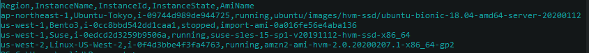

Python script to describe ec2 instances in all regions of an AWS account, and write the output to a CSV file.
Displays the Region, Instance Name, Instanec Id, Instance State, and the name of the AMI used.

Sample output from running the script.

                           

